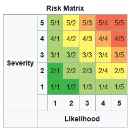

Appendix F: HSE Procedure
=========================

======= ======== ========= ======== ====================================
Version Date     Author    Reviewer Description
0.1     14/12/25 S Roberts -        First version for review by Trustees
\                                   
======= ======== ========= ======== ====================================

Introduction
============

Purpose
-------

This document sets out the principles of ensuring the safety of members of Nottingham Hackspace (NH) and other persons visiting the space. It should be read and understood by trustees and members of the safety team. Other team members may benefit from reading it. It should be available to any member but is not required reading.

Scope
-----

This document describes the top-level guiding principles only; the specific precautions and procedures for areas, tools, activities etc. are not included in this document.

Definitions for this document
-----------------------------

As well as those in `definitions <definitions.html>`_, this document uses some additional definitions and abbreviations.

* **NH** abbreviates Nottingham Hackspace Ltd
* **The landlord** refers to the organisation (currently BizSpace) from whom NH rents the space
* **PAT testing** abbreviates Portable Appliance Testing testing
* **RAMS** abbreviates Risk Assessment Method Statement
* **Teams** are groups of members who volunteer on behalf of NH to maintain specific areas of the space.

In this document, "member" refers to any person currently a member of Nottingham Hackspace as defined in section 2 of the Articles AND guests AND visitors.

QUESTION: should above instead be "participant in the space" or "user of the space"? (needs bikeshedding)

TODO: replace "the trustees" with the board

Assumptions
===========

This section lists a number of mitigations and precautions that can reasonably be assumed to be in place at NH, on the basis of the membership rules, fabric of the building in which the Hackspace is located, and common practice (which may not be robustly documented but is verifiable through informal record-keeping such as [wiki]_ and [discord]_.

Member competence
-----------------

NH does not, in general, provide training to members (with the exception of tool inductions – see `2.3 <#anchor-8>`__ ), nor are members subject to direct supervision. A condition of membership is acceptance of the membership rules [rules]_, which place responsibility for safety on individual members; those who are found to have violated this requirement are subject to temporary or permanent exclusion. Entry to the property is controlled by electronic doors (requiring a personal RFID card) as well as combination locks whose codes are available only to members. This means that non-members, or members who have demonstrated an unwillingness or inability to use the space and equipment within it safely, cannot gain access.

To facilitate the safe use of equipment, NH has various online resources such as [guide]_, [wiki]_ and [discord]_, which act as a repository of knowledge, including user manuals, and allow members to seek advice from those with more experience.

Non-members
-----------

Non-members are permitted in the space when accompanied by a member; they are subject to the same restrictions as members and must be supervised by a member.

Occasionally, NH organises events that allow non-members to enter the space for a specific activity. Such events require a risk assessment to be undertaken.

Inductions
----------

Notwithstanding the requirement for members to use equipment responsibly, some tools are access-controlled (again using the member's RFID card) and cannot be used without mandatory training. Most tools are not induction controlled, but those that are controlled may be subject to induction for one or more of the following reasons:

    - The tool is particularly hazardous to the user, with a high likelihood of serious injury.
    - The tool can be hazardous to non-users, such as tool that could cause a fire if used improperly.
    - The tool itself may be damaged if used incorrectly.

Evidently, the latter is not a safety-related reason.

**RECOMMENDATION**: currently, the reason for a tool being restricted in this way is not well recorded. Where safety is the reason, this should be recorded and the safety aspects of the induction should be documented clearly and publicly, and ideally there should be a defined process by which a tool is included or excluded.

Accident and near-miss reporting
--------------------------------

In order to monitor safety-related incidents in the space, an online form [accidents]_ is provided for members to make reports. This form submits information to the trustees, and actions may be taken accordingly (such as repairing a dangerous item, contacting an individual member, etc.).

**RECOMMENDATION**: the accident report data is not currently transparent. It could be useful to make it more public to help with awareness, feedback and engagement, with permission/anonymisation as needed. Examples: highlight when accidents have occurred to raise awareness of hazards; show that reports have resulted in beneficial changes; improve the quality of preventative action by gathering recommendations from the membership.

PAT testing
-----------

NH has equipment to perform PAT testing and testing is undertaken regularly. Record-keeping is limited although all tested equipment has a dated sticker applied.

While keeping a full record of each item that is tested is needlessly onerous, a formal record of each occasion that a PAT “sweep” has been conducted would be useful. This has been added to the list of regular checks.

PPE and 1\ :sup:`st` aid equipment
----------------------------------

Personal protective equipment (such as eyewear, ear defenders, face masks and gloves are located throughout the space) in appropriate locations. First aid kits (plasters, bleed kits, eye wash, etc.) are also available.

There is currently no formal process for checking that PPE and 1\ :sup:`st` aid kits are complete and adequate and so this has been added to the list of regular checks.

Lone working
------------

There is no practical means to prevent individuals from working alone at the space. In line with [rules]_ and [guide]_, members are expected to exercise good judgement if they are in space by themselves, although there are currently no specific guidelines regarding lone working.

**RECOMMENDATION**: provide guidance and policy regarding lone working. For example, communicate with a nominated “buddy” to check you are OK, and refrain from using tools that have the potential to cause serious injury or fire. We can’t enforce this but we can at least prompt people
to stop and think.

Maintenance
-----------

Damaged, faulty or degraded equipment can cause additional or increased risk hazards. This is partly mitigated by the expectation of user competence and the availability of user manuals, and in addition by the presence of member teams who take specific responsibility for areas or types of equipment. Members are encouraged to report suspected or known faulty equipment both informally on Discord [discord]_ and formally through the HMS “broken tools” form via [hms]_.

Housekeeping
------------

NH holds regular “Hack the Space” days when members are encouraged to visit the space to clean, tidy and generally make improvements and repairs. The types of activities undertaken are determined based on need at the time ad availability of members to assist but typically address
safety issues:

    - General cleaning and tidying, to ensure walkways are clear of trip and slip hazards
    - Removal of unused/abandoned material and emptying bins to remove fire hazards
    - Inspection of tools and consumables to remove defective items (e.g., throwing away broken or blunt tools)

Fire safety
===========

.. _scope-1:

Scope
-----

The space is located in a building that includes multiple rented “units” (i.e., rooms or series of interconnected rooms). Access to the space is primarily through shared/communal areas in the building. Evidently, the landlord bears a significant responsibility for ensuring the safety of all tenants, such as through fire alarm systems and maintaining clear exit routes through communal areas.

NH is responsible for the following:

    - Assessing fire risks within the space and ensuring that they are adequately controlled
    - Maintaining any fire safety equipment within the space
    - Confirming that the landlord is maintaining the communal areas areas and associated fire safety equipment (such as fire alarms throughout the building, escape routes, emergency lights, signs, fire doors, etc.).

Record-keeping
--------------

**RECOMMENDATION:** NH needs a specific and robust way to store information related to fire safety, which would constitute the fire safety logbook (this could potentially be be the NH wiki, a network drive or similar). Alternatively, a paper logbook could be used.

The following are to be stored in (or copied to) the fire safety logbook:

    - The fire risk assessment, any actions that are taken in response to it, and any updates made that result from reinspection or changes to the space.
    - The results of the regular walkabout inspections [walkabouts]_
    - Testing, inspection and maintenance of fire-safety equipment
    - Communications from the landlord relating to fire safety, including evidence of testing, inspection and maintenance.

Fire risk assessment
--------------------

NH periodically employs external contractors to undertake an inspection and risk assessment of fire safety at the space. This occurs at least once every ??? years.

Emergency evacuation
--------------------

The space has limited equipment for fire detection, since the activities that take place therein are likely to cause false alarms (dust, fumes, etc. from woodwork, metal grinding, painting, welding and other activities). Identification of active fires relies on observation by a person and the activation of a manual fire alarm button. Fire alarm buttons are present throughout the space (including at all fire exit doors) and the alarm system is connected to the building fire alarm.

Fire-fighting equipment
-----------------------

Portable fire extinguishers are located at various locations within the space. Inspection and maintenance of these is part of the regular safety walkabout [walkabouts]_.

QUESTION (from Sam): Is there a fire blanket in the kitchen?

Communication and training
--------------------------

Signage for fire action?

**RECOMMENDATION**: it is not practical to perform in-person training, or to mandate and record online training, for all members of NH. However, given the criticality of fire safety it would be advisable to provide some information, e.g., a crib sheet sent to new members, that gives key information such as:

    - How to raise the alarm
    - Where fire escapes are located
    - What to do if trapped
    - How and when to use fire-fighting equipment

Any changes to equipment, layout or guidance could be communicated through an update to this.

Risk assessments
================

Risk assessments vs method statements
-------------------------------------

It is common to find that risk assessments and method statements (or user manuals, guidelines, safe working procedures, etc.) become muddled together in practice, but a risk assessment is not a procedure document, it is only an assessment of the current situation.

How a risk assessment should work:

    1. Define scope of assessment (e.g., an area, activity, piece of equipment), including any existing controls that are already in place.
    2. Identify hazards that are within the scope of the assessment, rate based on the existing controls.
    3. Determine where risk is unacceptable and identify additional controls to reduce the risk to a reasonable level. The additional controls are actions taken by the Hackspace, not actions on a person who is at risk – the risk assessment is not a procedure. If a procedure is required, the action is to generate a procedure.
    4. Implement the additional controls that have been identified and record that they are implemented.

How it often ends up:

    1. Give a slightly vague title that doesn’t explain what’s covered
    2. Identify hazards and make up mitigating controls that might exist in some cases
    3. Add extra controls that are essentially advice and not actually implemented in a measurable way.

Procedures, processes or method statements are a valid *output* from a risk assessment. However, if relied upon as a control, there must be a reasonable expectation that they will be followed. Simply writing a few bits of helpful advice in a risk assessment that is stored on the wiki might not suffice in an environment like the space; any procedures would need to be displayed on a poster or handbook nearby, for example, such that we can reasonably believe they will be read and followed, as it is known that members do not always refer to the wiki.

It should be noted that the legal requirement is for a *risk assessment* to be performed. Further actions/documentation/etc. are only needed if
the assessment identifies any problems.

Examples
~~~~~~~~

The table below aims to give an example of bad and good risk assessments, with the bad version blurring into procedures and advice where the good version deals strictly with specifics.

Example of good and bad risk assessment approaches:

+-------------+-------------+-------------+-------------+-------------+
| Scope       | Using a     | Not clear   | Using a     |             |
|             | jigsaw for  | what type   | ma          |             |
|             | woodwork    | of jigsaw   | ins-powered |             |
|             |             | or what we  | (corded)    |             |
|             |             | might be    | hand-held   |             |
|             |             | doing with  | jigsaw to   |             |
|             |             | it. A       | cut wood,   |             |
|             |             | battery     | plastic,    |             |
|             |             | powered     | aluminium   |             |
|             |             | device is   | and other   |             |
|             |             | different   | soft        |             |
|             |             | to a mains  | materials,  |             |
|             |             | powered     | including   |             |
|             |             | one, for    | handling    |             |
|             |             | example.    | material    |             |
|             |             |             | before and  |             |
|             |             |             | after       |             |
|             |             |             | cutting and |             |
|             |             |             | changing    |             |
|             |             |             | blades when |             |
|             |             |             | required.   |             |
+-------------+-------------+-------------+-------------+-------------+
| Task and    | Cut fingers | It is not   | Removing or | Removing or |
| hazard      | while       | made clear  | installing  | installing  |
|             | removing or | why a user  | a new blade | a new blade |
|             | installing  | would cut   | – saw is    | – minor     |
|             | a new       | their       | in          | cuts due to |
|             | blade.      | fingers.    | advertently | handling of |
|             |             |             | started     | sharp       |
|             |             | Also, this  | resulting   | blades.     |
|             |             | is better   | in serious  |             |
|             |             | split into  | laceration, |             |
|             |             | two         | potential   |             |
|             |             | separate    | amputation. |             |
|             |             | hazards -   |             |             |
|             |             | unlikely    |             |             |
|             |             | but high    |             |             |
|             |             | severity    |             |             |
|             |             | and         |             |             |
|             |             | vice-versa. |             |             |
+-------------+-------------+-------------+-------------+-------------+
| Existing    | Turn off    | It is not   | None        |             |
| mitigation  | power when  | stated how  | currently.  |             |
|             | changing    | the user is |             |             |
|             | blade.      | made aware  |             |             |
|             |             | of the      |             |             |
|             |             | necessity   |             |             |
|             |             | to turn off |             |             |
|             |             | the power.  |             |             |
|             |             | This is a   |             |             |
|             |             | piece of    |             |             |
|             |             | advice to   |             |             |
|             |             | do          |             |             |
|             |             | something   |             |             |
|             |             | that is     |             |             |
|             |             | possible.   |             |             |
+-------------+-------------+-------------+-------------+-------------+
| Likelihood  | 1           | The         | 3           | 2           |
|             |             | assessed    |             |             |
|             |             | hazard is   |             |             |
|             |             | the worst   |             |             |
|             |             | case (a     |             |             |
|             |             | li          |             |             |
|             |             | fe-changing |             |             |
|             |             | injury) but |             |             |
|             |             | the         |             |             |
|             |             | description |             |             |
|             |             | just says   |             |             |
|             |             | “cut”.      |             |             |
+-------------+-------------+-------------+-------------+-------------+
| Severity    | 4           | 2           | 4           |             |
+-------------+-------------+-------------+-------------+-------------+
| Rating      | 4           | 6           | 8           |             |
+-------------+-------------+-------------+-------------+-------------+
| Additional  | Wear gloves | This is a   | Make cut    | Add signage |
| mitigations |             | piece of    | resistant   | advising    |
|             |             | general     | gloves      | users to    |
|             |             | advice that | available.  | isolate     |
|             |             | does not    | Store near  | power       |
|             |             | relate to a | to spare    | before      |
|             |             | specific    | blades.     | changing    |
|             |             | aspect of   |             | blades on   |
|             |             | the hazard. |             | power       |
|             |             |             |             | tools.      |
+-------------+-------------+-------------+-------------+-------------+
| Likelihood  | 1           | The         | 2           | 1           |
|             |             | additional  |             |             |
|             |             | mitigation  |             |             |
|             |             | does not    |             |             |
|             |             | affect the  |             |             |
|             |             | more severe |             |             |
|             |             | hazard.     |             |             |
+-------------+-------------+-------------+-------------+-------------+
| Severity    | 4           | 2           | 4           |             |
+-------------+-------------+-------------+-------------+-------------+
| Rating      | 4           | 2           | 4           |             |
+-------------+-------------+-------------+-------------+-------------+

When to generate a risk assessment
~~~~~~~~~~~~~~~~~~~~~~~~~~~~~~~~~~

Risk assessments are required when:

    - A new tool, area or activity is added to the space (or an existing one is found not to have an assessment)
    - An existing risk assessment reaches its review date (typically after 2 years)]
    - An incident, accident or near-miss report is deemed of sufficient severity to warrant review of an existing risk assessment

Risk assessment procedure
~~~~~~~~~~~~~~~~~~~~~~~~~

Risk assessments are needed to cover all foreseeable activities that take place in the space. In practice, this means grouping activities by equipment, materials or location, to minimise the number of separate risk assessments that are required. There is a balance to be struck between generic and specific risk assessments; too generic (e.g., “woodwork”) means that the risk assessment becomes cumbersome, or misses important details; too specific means the number of assessments becomes a challenge, and crucially that lessons are not passed between similar items (for example, if a near miss is reported on a metalwork bandsaw, resulting in an updated risk assessment, this might not be implemented for a woodworking bandsaw). 

The steps below provide guidance on generating a risk assessment:

    1. Confirm that the equipment, area or material is not (or could not be) already covered by an existing assessment. If possible, add it to the scope of an existing risk assessment.
        *Example: a new power tool is obtained for woodworking. The workshop area risk assessment includes generic hazards that pertain to power tools but does not name this type of tool. However, this tool does not have any unique hazards and so can be included. Update the existing RA rather than creating a new one.*
    2. Identify a suitable scope in which to include the new item – ideally, be as generic as possible by including other items that have similar hazards. Ensure that the scope and limitations are clearly stated.
        *Example: a single risk assessment could cover 3D printing using any model of FDM printer using non-hazardous materials. The scope can explicitly state that all FDM printers are included but that materials that produce harmful fumes are excluded. This does not mean that such materials are banned, but that a separate assessment would be needed to use them.*
    3. Identify tasks that are within scope, including preparing, tidying and any foreseeable maintenance/setup. Again, avoid being over-specific to ensure conciseness.
    4. Consider all hazards that may arise during that task and assess existing mitigations, likelihood and severity of each of them.
    5. Based on the risk matrix, score each hazard

.. _risk_matrix:
============= ===========================================
|risk_matrix| 1-2 = no action required
         
              3-5 = address if possible
         
              6+ = action required
         
              11+ = task prohibited until action complete
============= ===========================================

    6. Generate additional mitigations according to the risk matrix
    7. Repeat for all tasks
    8. Collate all actions and assign owners and due dates

Open actions
~~~~~~~~~~~~

All actions pertaining to risk assessments must monitored by the trustees. Overdue actions should be followed up and appropriate action taken (either to set a more realistic date, reassign to someone else, change to a more achievable action or to call a stop on the activity until the action is resolved in extreme cases).

**RECOMMENDATION**: headline numbers for safety actions should be reported regularly (e.g. at the monthly members’ meeting) - total actions open, number of new actions this month, number closed, etc.

Area risk assessments
~~~~~~~~~~~~~~~~~~~~~

An area risk assessment would cover all or most activities that take place in a certain area, based on the type of equipment and material normally used there. For example, most metalworking area activities might be covered by an area risk assessment, with exclusions for specific tools (induction tools and welders).

Tool risk assessments
~~~~~~~~~~~~~~~~~~~~~

A tool risk assessment covers a specific tool (either a unique or particularly dangerous tool), or a range of similar tools (such as electric drills or soldering irons).

Activity risk assessments
~~~~~~~~~~~~~~~~~~~~~~~~~

An activity might take place in multiple areas or use a variety of tools and materials. For example, debugging electronic devices does not necessarily take place in the electronics area, and lifting heavy items typically requires multiple tools and takes place across multiple areas.

COSHH assessments
~~~~~~~~~~~~~~~~~

Nightmare

Best efforts – signage and cabinets

RAMS
----

A risk assessment may indicate that a method statement is an appropriate way to communicate good practice to members. The method statement may be, for example, a list of precautions, a step-by-step procedure or an induction checklist. The appropriate way to convey the method statement will depend on the tool, hazards and expected usage.

However it is communicated, a method statement arising from a risk assessment must be stored appropriately in an accessible and defined location (e.g., the NH wiki) and must be referenced in the risk assessment. It is also necessary to ensure that safety-critical RAMS are displayed prominently, such as on a poster or laminated instructions, unless there are means to ensure that members will look at the wiki.

Dynamic Risk Assessments
------------------------

As far as possible, activities should be covered by pre-prepared written risk assessments. However, it is the nature of the varied activities and membership of NH that many activities are not foreseeable, and in many cases will be performed as a “one off” task (for example, moving a heavy piece of material). Dynamic risk assessments [dras]_ are a way to encourage (in the case of NH) members to stop and think about risks in a structured manner before undertaking an unfamiliar task, and to plan hazardous tasks in a more careful manner, without necessarily requiring formal risk assessments to be created.

**RECOMMENDATION**: add dynamic risk assessment to member guidelines, possibly with signage to encourage this way of thinking in the space.

Maintaining safe operation
==========================

New tools
---------

NH commonly acquires tools to add to or enhance its portfolio, or to replace those that become damaged or lost. Most frequently, this entails the addition of an item that is similar enough to something that already exists in the space, but it is in the nature of NH that genuinely novel items are also added. An additional consideration is that “new” tools are often 2\ :sup:`nd` hand, and may therefore be subject to significant wear and tear.

Currently, there are no formal processes to manage to adoption of new items, although generally good practice is followed by the various teams in the space to assess and commission new items.

**RECOMMENDATION:** when NH acquiring tools, a simple tick-list should be followed to confirm that the item has been risk-assessed, and PAT tested and inspected if it was a donation or purchased 2\ :sup:`nd`
hand.

Changes to layout and use
-------------------------

**RECOMMENDATION:** similarly to adding new tools, new operations or the movement of operations to a different location should be tracked through some form of change management process, to ensure that risk assessments are not invalidated.

Regular RA review
-----------------

**RECOMMENDATION:** all risk assessments should have a validity period, and a regular review should be undertaken by the trustees or safety team to identify any risk assessments that require attention.

Walkabout inspections
---------------------

Walkabout inspections are to be performed once a fortnight by a trustee or member of the safety team. The inspection uses a google form [walkabouts]_ and automatically stores the outcome of each inspection.

**Red items are required by the fire log book**

WEEKLY:

    - Check PPE dispensers. Record if consumables are replenished (e.g., ear plugs). Record if reusable items are missing (e.g., ear defenders).
    - Check 1\ :sup:`st` aid kits are in their nominal locations.
    - Check all walkways are clear of obstruction. Clear and record minor obstructions if practical to do so, report any remaining obstructions.
    - Check all floors are clear of dust and other slip hazards.
    - Test all fire exit mechanisms and confirm signs are present
    - Check the battery charging area is clear of combustible material, disconnect batteries if fully charged

MONTHLY:

    - Open all 1\ :sup:`st` aid kits and check quantities and expiry dates, replenish as required and record
    - <List of 1\ :sup:`st` aid locations and contents of each>
    - Check for large/heavy items that are placed on high or otherwise unsuitable shelves
    - Confirm (e.g., via the members meeting) that someone from each team has visited the space and performed a visual inspection of tools/equipment/facilities
    - Sweep for PAT test stickers that are (over)due for renewal or missing and test as required
    - Check for battery-powered tools that are damaged, leaking, etc
    - Inspect fire extinguishing equipment (maintenance labels, pressures, tags, visible damage)
    - Inspect storage areas for excessive quantities of flammable material (especially cardboard)

?? ANNUALLY ??:

    - Inspection/test regime for emergency lighting
    - Inspection regime for all NH fire doors
    - Full space fire risk assessment

References
----------

.. [rules] Membership rules, as stated on this site `Nottingham Hackspace Rules <https://rules.nottinghack.org.uk/en/latest/>`_ 
.. [guide] The members' guide: `<https://guide.nottinghack.org.uk/>`_
.. [wiki] The hackspace wiki `<https://wiki.nottinghack.org.uk/>`_
.. [discord] The hackspace discord `<https://discord.gg/zx8Dc6Y32E>`_
.. [hms] The Hackspace Management System `https://hms.nottinghack.org.uk <https://hms.nottinghack.org.uk/links>`_
.. [accidents] The accident form: `<https://forms.gle/q7AvtYG5mPNuJCvh9>`_
.. [constitution] The Hackspace's constitution `<https://wiki.nottinghack.org.uk/wiki/Constitution>`_
.. [dras] What is a dynamic risk assessment? `<https://www.chas.co.uk/blog/what-is-a-dynamic-risk-assessment/>`_
.. [walkabouts] DRAFT Google form for walkabout inspection `<https://docs.google.com/forms/d/e/1FAIpQLSf4YtLO8mHLyYijsJwc6Ubo-QpjnwNkEeoD0aEfjOSC8JB2ew/viewform?usp=header>`_
